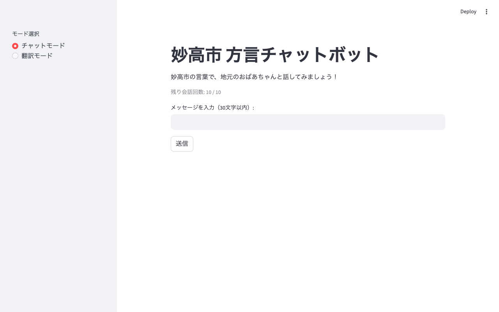
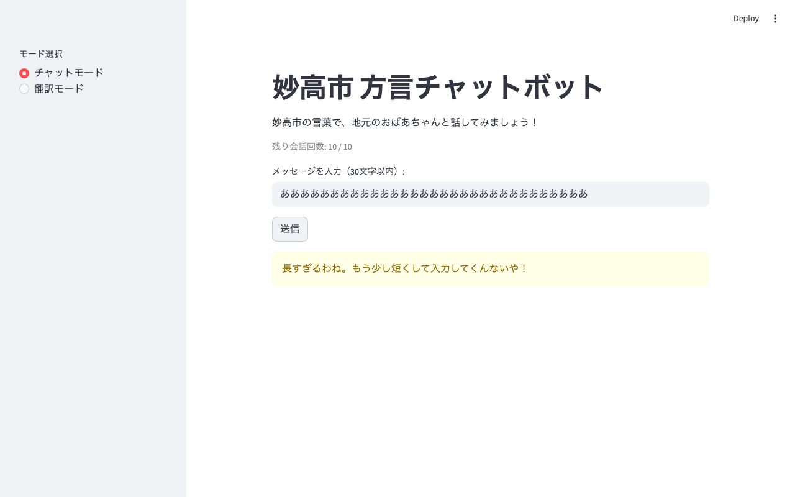
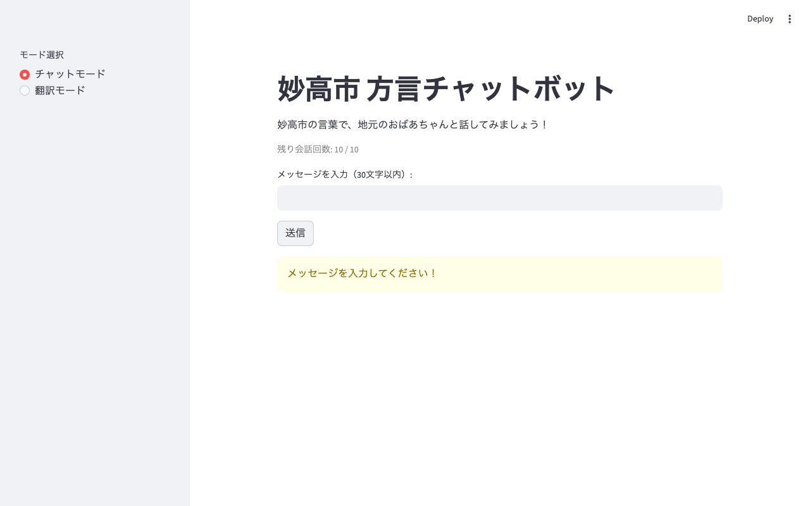
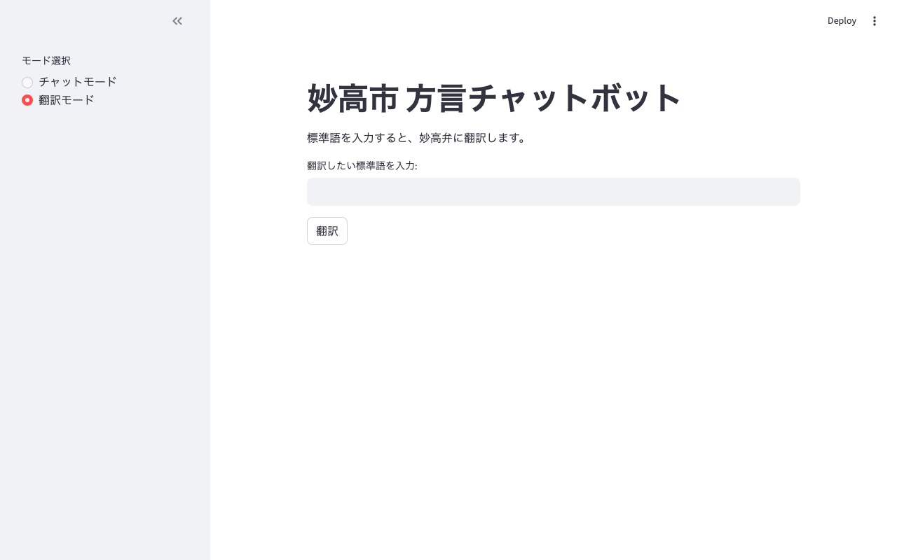

# Playwright 動作確認レポート

**作成日:** 2026-06-04  
**対象:** `app.py`（フェーズ3改修版）  
**目的:** Playwright によるブラウザ自動化を使った UI 動作確認の実施  
**スクリプト:** `verify_playwright.py`  
**スクリーンショット保存先:** `_memo/screenshots/`

---

## 1. Playwright のインストール

### 実施コマンド

```bash
# ① Playwright ライブラリを仮想環境にインストール
.venv/bin/pip install playwright

# ② Chromium ブラウザバイナリをダウンロード
.venv/bin/playwright install chromium
```

### インストール結果

| 手順 | 結果 |
|------|------|
| `pip install playwright` | 成功 |
| `playwright install chromium` | Chromium 148.0（92.4 MiB）をダウンロード・インストール完了 |

### Playwright の仕組み

Playwright はブラウザ（Chromium / Firefox / WebKit）をプログラムから制御するライブラリ。`headless=True` オプションを指定すると、画面を表示せずバックグラウンドでブラウザを動かせる（ヘッドレスモード）。Streamlit のような React ベースの SPA は JavaScript が描画するため、`curl` では内容を取得できない。Playwright はブラウザを実際に起動してページを描画するため、ウィジェットの内容・ボタンのクリック・画面遷移をプログラムで操作・確認できる。

---

## 2. 確認シナリオと結果

### Streamlit アプリの起動

```bash
.venv/bin/streamlit run app.py --server.headless true --server.port 8501 &
```

HTTP 200 を確認してから Playwright スクリプトを実行した。

---

### テスト 1: 初期表示の確認

**操作:** `http://localhost:8501` を開き、スクリーンショットを取得

**スクリーンショット:**



**確認コード（抜粋）:**

```python
page.goto(BASE_URL)
page.wait_for_load_state("networkidle")
time.sleep(1)

title_ok    = page.locator("h1").filter(has_text="妙高市").count() > 0
sidebar_radio = page.locator("[data-testid='stRadio']").count() > 0
chat_label  = page.locator("text=チャットモード").count() > 0
trans_label = page.locator("text=翻訳モード").count() > 0
```

**結果:**

| 確認項目 | 結果 |
|---------|------|
| タイトルに「妙高市」が含まれる | ✅ PASS |
| サイドバーにラジオボタンが表示される | ✅ PASS |
| 「チャットモード」ラベルが存在する | ✅ PASS |
| 「翻訳モード」ラベルが存在する | ✅ PASS |

**スクリーンショットから確認できた内容:**
- 左サイドバーに「モード選択」ラジオボタン（チャットモード●・翻訳モード○）
- タイトル「妙高市 方言チャットボット」
- 説明文「妙高市の言葉で、地元のおばあちゃんと話してみましょう！」
- 「残り会話回数: 10 / 10」
- 「メッセージを入力（30文字以内）:」ラベルと入力フィールド
- 「送信」ボタン

---

### テスト 2: チャットモードの UI 要素確認

**確認コード（抜粋）:**

```python
remaining  = page.locator("text=残り会話回数").count() > 0
input_field = page.locator("[data-testid='stTextInput']").count() > 0
send_btn   = page.locator("button", has_text="送信").count() > 0
```

**結果:**

| 確認項目 | 結果 |
|---------|------|
| 残り会話回数が表示される | ✅ PASS |
| テキスト入力フィールドが存在する | ✅ PASS |
| 送信ボタンが存在する | ✅ PASS |

---

### テスト 3: 入力文字数制限（31文字で警告）

**操作:** 「あ」を 31 文字入力して「送信」をクリック

**スクリーンショット:**



**確認コード（抜粋）:**

```python
text_input = page.locator("[data-testid='stTextInput'] input").first
text_input.fill("あ" * 31)
page.locator("button", has_text="送信").click()
page.wait_for_load_state("networkidle")

warning_shown = page.locator("[data-testid='stAlert']").count() > 0
```

**結果:**

| 確認項目 | 結果 |
|---------|------|
| 31文字入力で警告が表示される | ✅ PASS |

**スクリーンショットから確認できた内容:**
- 黄色い警告ボックスに「長すぎるわね。もう少し短くして入力してくんないや！」と表示
- 方言の警告文が正しく表示されている

---

### テスト 4: 空入力で警告

**操作:** 入力フィールドを空にして「送信」をクリック

**スクリーンショット:**



**確認コード（抜粋）:**

```python
text_input.fill("")
page.locator("button", has_text="送信").click()
warning_shown = page.locator("[data-testid='stAlert']").count() > 0
```

**結果:**

| 確認項目 | 結果 |
|---------|------|
| 空入力で警告が表示される | ✅ PASS |

---

### テスト 5: 翻訳モードへの切り替え

**操作:** サイドバーの「翻訳モード」ラジオボタンをクリック

**スクリーンショット:**



**確認コード（抜粋）:**

```python
page.locator("[data-testid='stRadio'] label", has_text="翻訳モード").click()
page.wait_for_load_state("networkidle")

trans_input = page.locator("[data-testid='stTextInput']").count() > 0
trans_btn   = page.locator("button", has_text="翻訳").count() > 0
send_gone   = page.locator("button", has_text="送信").count() == 0
```

**結果:**

| 確認項目 | 結果 |
|---------|------|
| テキスト入力フィールドが表示される | ✅ PASS |
| 「翻訳」ボタンが表示される | ✅ PASS |
| チャットの「送信」ボタンが消える（モード切替成功） | ✅ PASS |

**スクリーンショットから確認できた内容:**
- サイドバーのラジオが「翻訳モード●」に切り替わっている
- 説明文が「標準語を入力すると、妙高弁に翻訳します。」に変わっている
- 「翻訳したい標準語を入力:」ラベルと入力フィールド
- 「翻訳」ボタン（「送信」ボタンは消えている）
- チャット履歴が消えている（セッションリセット確認）

---

### テスト 6: チャットモードに戻してセッションリセット確認

**操作:** 「チャットモード」ラジオボタンをクリック

**スクリーンショット:**


**確認コード（抜粋）:**

```python
page.locator("[data-testid='stRadio'] label", has_text="チャットモード").click()
page.wait_for_load_state("networkidle")

chat_input_restored = page.locator("[data-testid='stTextInput']").count() > 0
```

**結果:**

| 確認項目 | 結果 |
|---------|------|
| チャット入力フィールドが再表示される（リセットOK） | ✅ PASS |

**スクリーンショットから確認できた内容:**
- 「残り会話回数: 10 / 10」に戻っている（会話カウントがリセットされている）
- 入力フィールドと「送信」ボタンが再表示されている
- 会話ログが空（リセットされている）

---

## 3. 総合結果

| テスト | 確認項目数 | PASS | FAIL |
|--------|-----------|------|------|
| 初期表示 | 4 | 4 | 0 |
| チャットモード UI | 3 | 3 | 0 |
| 文字数制限（31文字） | 1 | 1 | 0 |
| 空入力警告 | 1 | 1 | 0 |
| 翻訳モード切替 | 3 | 3 | 0 |
| セッションリセット | 1 | 1 | 0 |
| **合計** | **13** | **13** | **0** |

**→ 13 件全件 PASS**

---

## 4. 確認できなかった項目

今回の Playwright 確認でカバーできなかった項目は以下の通り。

| 未確認項目 | 理由 |
|-----------|------|
| 実際の API コールでの方言会話・翻訳の応答内容 | テスト環境では本物の API キーでの送信を行わなかった |
| 会話10回上限に達したときのメッセージ | API 呼び出しなしでは会話カウントが増えないため |
| 翻訳モードの対訳2列表示（実際の翻訳結果） | 同上 |

これらは、実際に API キーを使って送信するエンドツーエンドテスト（E2E テスト）で確認する必要がある。

---

## 5. 今回の確認で学んだこと

### `wait_for_load_state("networkidle")` の役割

Streamlit は画面の更新に WebSocket 通信を使う。ボタンをクリックした直後はまだブラウザが再描画中のため、すぐに要素を探すと「まだ存在しない」状態になる。`networkidle`（ネットワーク通信が落ち着いた状態）を待つことで、再描画完了後に要素を確認できる。

```python
page.locator("button", has_text="送信").click()
page.wait_for_load_state("networkidle")   # ← これを入れないと次の確認が失敗する
```

### `[data-testid='stRadio']` のようなセレクタについて

Playwright でウィジェットを特定するには CSS セレクタを使う。Streamlit は内部的に `data-testid` 属性を各コンポーネントに付与しているため、`[data-testid='stRadio']` のように書くと安定してラジオボタングループを特定できる。テキストで特定する場合は `page.locator("text=チャットモード")` のように書く。

### `headless=True` とスクリーンショット

画面が表示されないヘッドレスモードでも `page.screenshot(path="...")` を呼ぶとファイルに PNG として保存される。CI（継続的インテグレーション）環境でも動作確認の証拠を残せるのがこの仕組みの強み。

---

## 6. 関連ファイル

| ファイル | 説明 |
|----------|------|
| `verify_playwright.py` | 今回実行した Playwright 確認スクリプト |
| `_memo/screenshots/01_initial.png` | 初期表示のスクリーンショット |
| `_memo/screenshots/03_char_limit_warning.png` | 文字数制限警告のスクリーンショット |
| `_memo/screenshots/04_empty_input_warning.png` | 空入力警告のスクリーンショット |
| `_memo/screenshots/05_translation_mode.png` | 翻訳モードのスクリーンショット |
| `_memo/screenshots/06_back_to_chat.png` | チャットモードに戻した後のスクリーンショット |
| `_memo/2026-05-28_verification_playwright_and_alternative.md` | Playwright 計画と代替手法の比較レポート |
| `_memo/2026-05-28_phase3_app_refactor.md` | フェーズ3改修内容のレポート |
